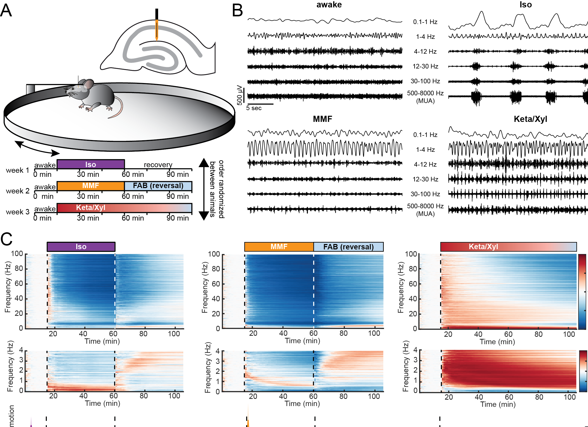

# Anesthetics uniquely decorrelate hippocampal network activity, alter spine dynamics and affect memory consolidation

This repository contains code related to the paper "Anesthetics fragment hippocampal networkactivity, alter spine dynamics and affect memory consolidation".
The manuscript is available here: https://www.biorxiv.org/content/10.1101/2020.06.05.135905v1

Code to align calcium imaging recordings from difference session but same FOV is in the [Alignment](https://github.com/mchini/Yang_Chini_et_al/tree/master/Alignment%20Scripts%20(Python)) folder

Before alignment             |  After alignment
:-------------------------:|:-------------------------:
  |  

Code for analysis of calcium transients and correlation matrices is in [Figures 3-5](https://github.com/mchini/Yang_Chini_et_al/tree/master/Figures%203-5%20(Python) folder

Scripts and datasets that were used for all statistical analysis are available in the folder "Stats".

Further code that was used for the ephys part of the paper can be found in this other [repository](https://github.com/mchini/HanganuOpatzToolbox)
{:height="20%" width="20%"}

Raw 2-photon and electrophysiology data is available at this [repository](https://gin.g-node.org/SW_lab/Anesthesia_CA1/) on GIN.
