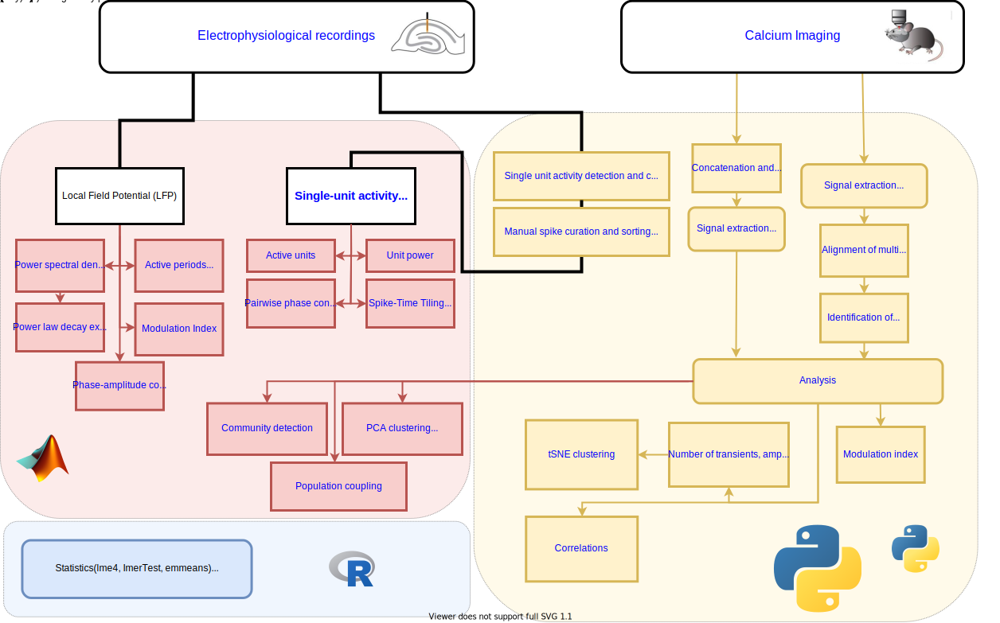
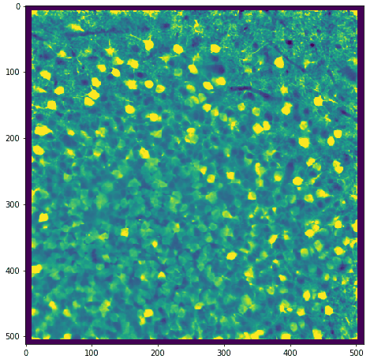
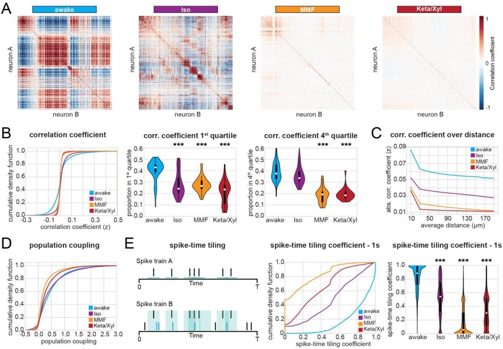
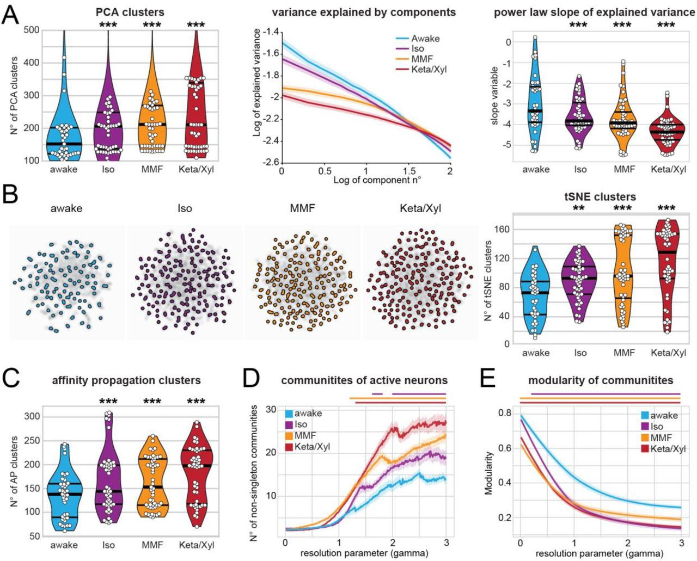
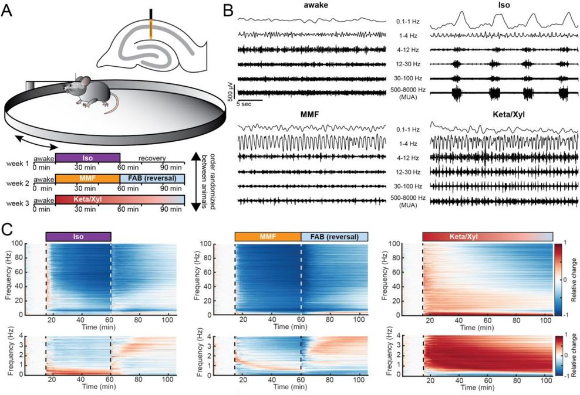

# Anesthetics uniquely decorrelate hippocampal network activity, alter spine dynamics and affect memory consolidation

This repository contains code related to the paper "Anesthetics fragment hippocampal network activity, alter spine dynamics and affect memory consolidation".
The manuscript is available here: https://www.biorxiv.org/content/10.1101/2020.06.05.135905v1

## Analysis pipeline

Click on the image below to open it in interactive mode: 

### Alignment of recordings across imaging sessions

Code to align calcium imaging recordings from different sessions but with the same FOV is in the [Alignment](https://github.com/mchini/Yang_Chini_et_al/tree/master/Alignment%20Scripts%20(Python)) folder.

Before alignment             |  After alignment
:-------------------------:|:-------------------------:
  |  

### Analysis of calcium transients and their correlations

Python code for analysis of calcium transients and correlation matrices is in [Figures 3-5](https://github.com/mchini/Yang_Chini_et_al/tree/master/Figures%203-5%20(Python)) folder

### Clustering and classification

Matlab code for clustering in the spatial and temporal domain and sleep classification is in the [Figures 5-7](https://github.com/mchini/Yang_Chini_et_al/tree/master/Figures%205-7%20(MATLAB)) folder

### Electrophysiology

Further Matlab code that was used for the ephys-part of the paper can be found in this other [repository](https://github.com/mchini/HanganuOpatzToolbox)

R scripts and datasets that were used for all statistical analysis are available in the [Stats](https://github.com/mchini/Yang_Chini_et_al/tree/master/Stats%20(R)) folder.

Raw 2-photon and electrophysiology data is available at this [repository](https://gin.g-node.org/SW_lab/Anesthesia_CA1/) on GIN.
